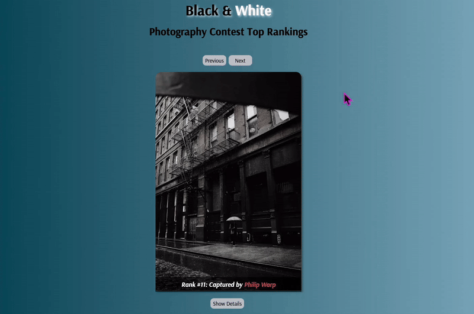

## Photography Contest Rankings

This repository contains the source code for a simple React-based image gallery showcasing the Top 30 ranked photographs from the **"Black and White Photography Contest Rankings."** The application allows users to browse through the photographs with ease.

## Demo



## Features

- Displays a collection of black-and-white photographs along with the photographer's name.
- Navigation buttons (Next and Previous) to browse through the photos.
- Displays the current photo index and the total number of photos.
- Disables navigation buttons when the user reaches the first or last photo.

## Technologies Used

- **React.js:** Front-end JavaScript library used for building the user interface and managing state.
- **React Hooks (useState):** Used for managing state and side effects in the application.
- **CSS:** Used for styling the application, making it visually appealing and easy to use. Custom CSS was implemented for responsive layouts, form designs, and transitions.
- **JavaScript (ES6+):** The core programming language used to build the logic and functionality of the app.

## Project Structure

```plaintext
📦src
 ┣ 📂helper
 ┃ ┗ 📜data.js
 ┣ 📜App.css
 ┣ 📜App.js
 ┗ 📜index.js
```
### Live Page

Click the link below to view the live version of the app:
[Live Page](https://zbaharyilmaz.github.io/photo-contest-rankings/)  

## Installation Instructions

To get started with the Mental Health App project, follow these steps:

Clone this repository to your local machine:
```
git clone https://github.com/zbaharyilmaz/photo-contest-rankings.git
```
Navigate into the project directory: 

```
cd photo-contest-rankings
```
Install the required dependencies:
```
pnpm install
```
Run the development server:
```
pnpm start
```
Open the application in your browser to view the project.

## License

MIT license